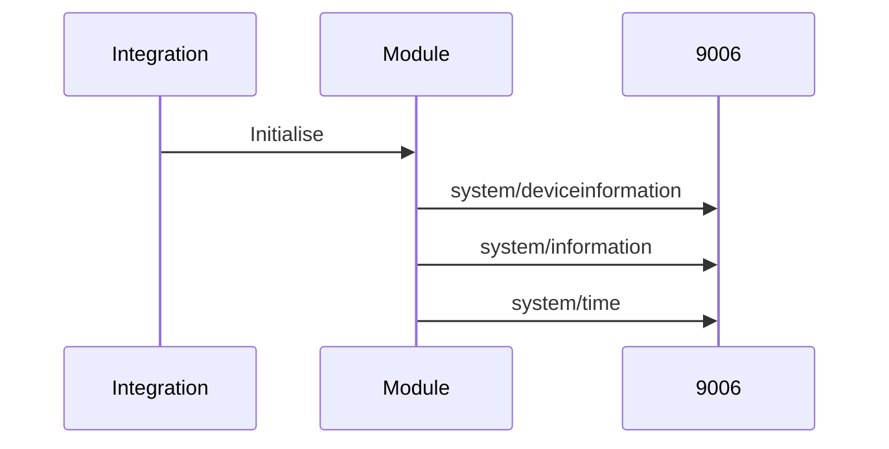
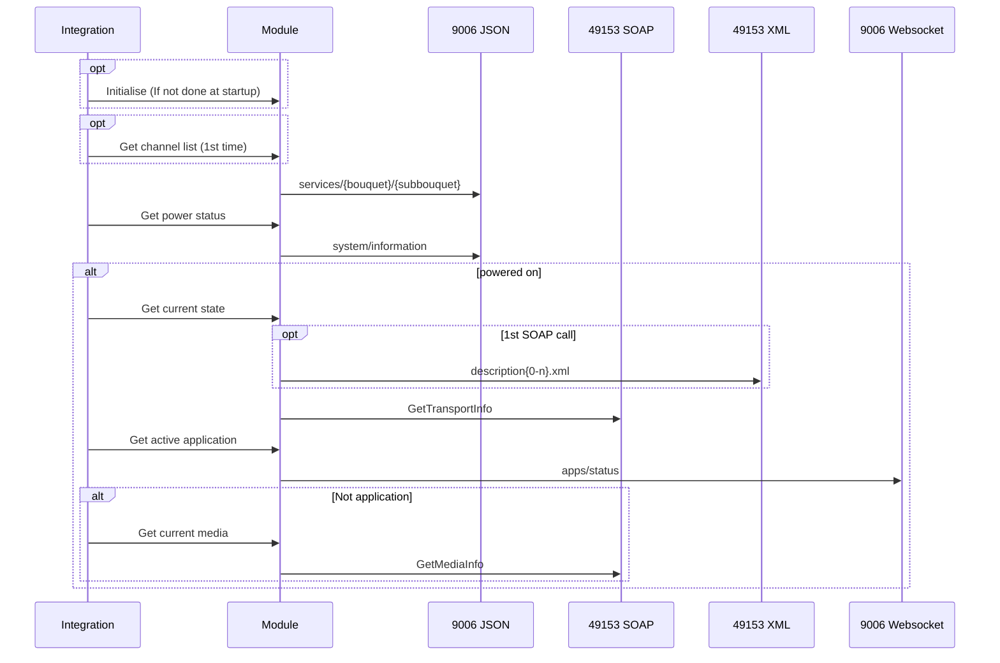

## Startup sequence

```mermaid
sequenceDiagram
participant I as Integration
participant M as Module
participant J as 9006
I->>M: Initialise
M->>J: system/deviceinformation
M->>J: system/information
M->>J: system/time
```

## Update sequence

```mermaid
sequenceDiagram
participant I as Integration
participant M as Module
participant J as 9006 JSON
participant S as 49153 SOAP
participant X as 49153 XML
participant W as 9006 Websocket
opt
  I->>M: Initialise (If not done at startup)
end
opt
  I->>M: Get channel list (1st time)
end
M->>J: services/{bouquet}/{subbouquet}
I->>M: Get power status
M->>J: system/information
alt powered on
  I->>M: Get current state
  opt 1st SOAP call
    M->>X: description{0-n}.xml
  end
  M->>S: GetTransportInfo
  I->>M: Get active application
  M->>W: apps/status
  alt Not application
    I->>M: Get current media
    M->>S: GetMediaInfo
  end
end
```
