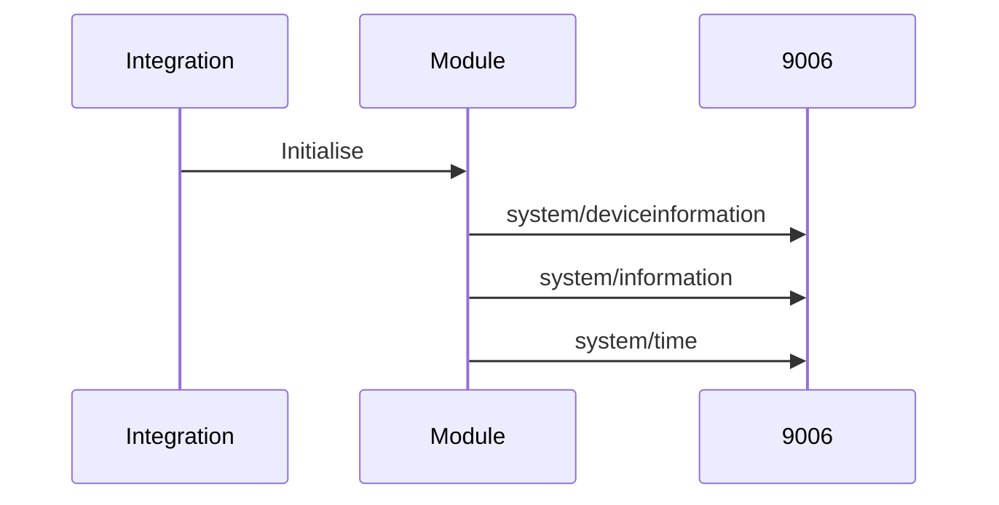
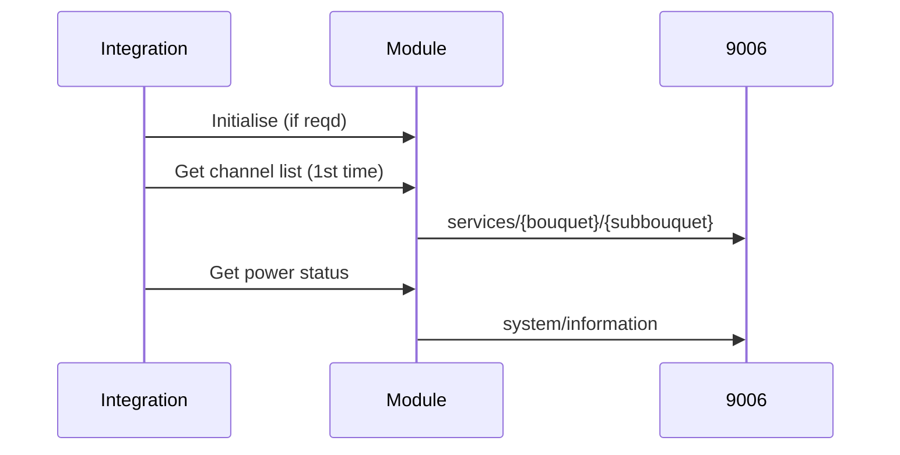

Startup sequence

```mermaid
sequenceDiagram
participant I as Integration
participant M as Module
participant J as 9006
I->>M: Initialise
M->>J: system/deviceinformation
M->>J: system/information
M->>J: system/time
```

Update sequence

```mermaid
sequenceDiagram
participant I as Integration
participant M as Module
participant J as 9006
I->>M: Initialise (if reqd)
I->>M: Get channel list (1st time)
M->>J: services/{bouquet}/{subbouquet}
I->>M: Get power status
M->>J: system/information
```
