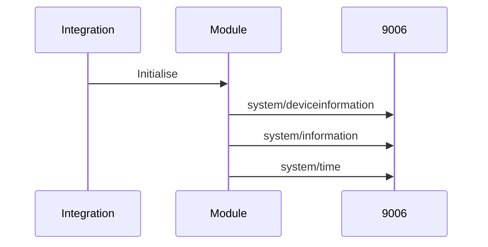

## Startup sequence



## Update sequence

```mermaid
sequenceDiagram
participant I as Integration
participant M as Module
participant J as 9006 JSON
participant S as 49153 SOAP
participant X as 49153 XML
I->>M: Initialise (if reqd)
I->>M: Get channel list (1st time)
M->>J: services/{bouquet}/{subbouquet}
I->>M: Get power status
M->>J: system/information
alt powered on
  alt 1st SOAP call
    M->>X: description{0-n}.xml
  M->>S: GetTransportInfo
```
